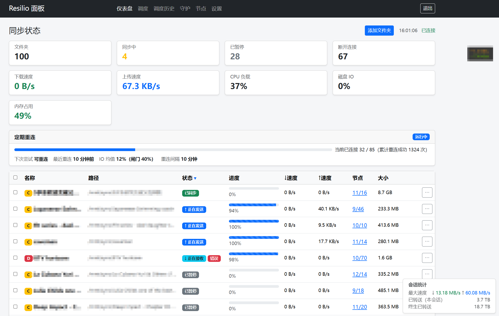
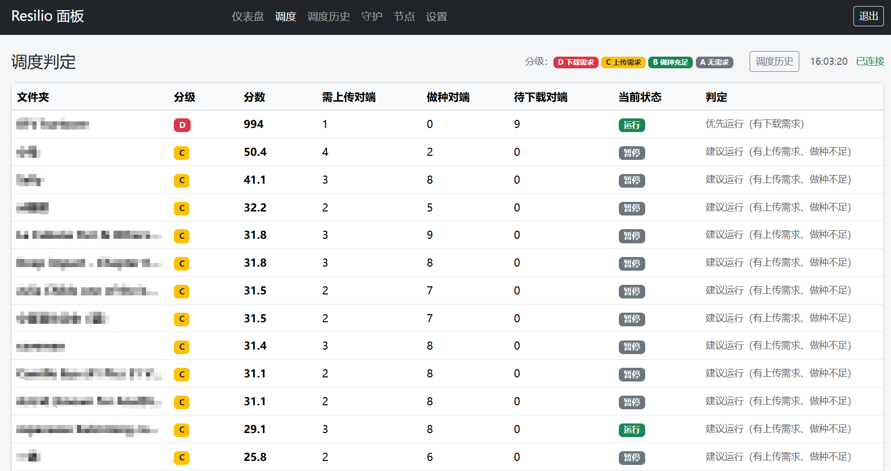
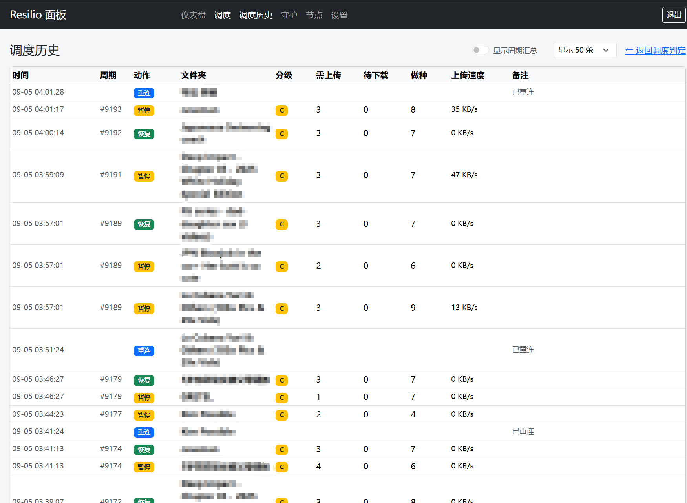
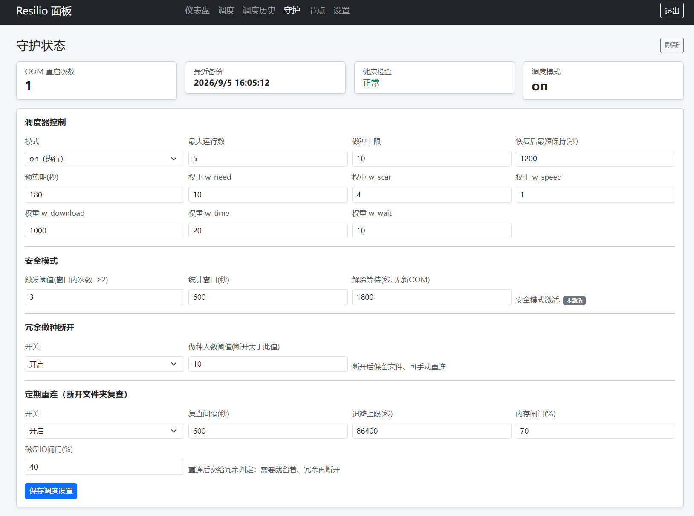

# rslsync-lite-panel

> Low-overhead management for Resilio Sync (rslsync) on resource-constrained servers: a lightweight local web panel + a server-side sync-guard.
>
> 为低配服务器上的 Resilio Sync(rslsync)减负:轻量本地 Web 面板 + 服务器端守护调度器。
>
> *This is a community project. Not affiliated with Resilio, Inc.*

## 为什么做这个

远端 VPS 配置低、同步文件夹多(~99 个),官方 Web UI 每次加载 2-5MB 静态资源、每 3 秒轮询 5+ 个接口,机器资源大量消耗在"伺候管理界面"上。

本项目的答案:**远端只出数据,本地负责渲染**。面板只对远端发最少最轻的 JSON API 调用,设计目标削减 80-90% 的远端请求量;同时在服务器端部署守护,解决低配机特有的 OOM 配置回退、进程假死与带宽争抢问题。

完整的问题定义、两次生产事故复盘与设计决策见 **[docs/case-study.md](docs/case-study.md)**。

## 架构

```
本地浏览器                本地面板(Flask)                远端服务器(VPS)
┌──────────┐   HTTP/JSON   ┌──────────────┐   最小 JSON   ┌─────────────────────┐
│ Dashboard │ ◄──────────► │  app.py      │ ◄──────────► │ ① rslsync GUI API    │
│ 调度/守护  │  (localhost)  │  resilio_api │  轮询 5-10s   │    :8888             │
│ 节点/设置  │               └──────────────┘              │ ② guard HTTP 接口    │
└──────────┘                                              │    :8890 (Token)     │
   浏览器 ──SSH 隧道──► 面板仅绑定 127.0.0.1                │ ③ sync-guard(systemd)│
                                                          └─────────────────────┘
```

| 组成 | 运行位置 | 说明 |
|------|---------|------|
| **本地面板** | 本地(Windows/Linux,Flask) | 仪表盘/调度/守护/节点/设置/批量操作,本地渲染 |
| **sync-guard** | 远端服务器(Linux,systemd 常驻) | OOM 配置保护、假死健康检查、稀缺性优先分批调度、Bearer Token 管理接口 |

## 面板功能

- **仪表盘**:文件夹状态(同步中/已暂停/断开等)、传输速度、进度、节点数、CPU/磁盘 IO 负载、会话统计
- **调度**:每个文件夹的 D/C/B/A 分级与判定分数,按分数排序;调度器每轮暂停/恢复历史
- **守护**:OOM 重启次数、最近备份、健康检查状态、调度器模式切换与调参
- **节点**:连接节点列表,含收发方向明细
- **设置**:全局限速、面板刷新频率、guard 接口配置、CSV 导入导出
- **批量操作与文件夹管理**:多选暂停/恢复/断开;添加(密钥+路径)/暂停/恢复/删除/重连

## 快速开始

### 本地面板

```bash
pip install -r requirements.txt
python app.py
# 浏览器打开 http://127.0.0.1:5000
```

登录表单填远端 Resilio Sync 地址(如 `https://<server-ip>:8888`)、用户名、密码。可选:设置页配置 guard 接口地址与 Token,解锁「守护」页。

### sync-guard(服务器端)

部署步骤(systemd 单元、环境变量、Token 配置、恢复流程)见 [sync-guard/resilio-sync-SOP.md](sync-guard/resilio-sync-SOP.md) §10。

### 示例

[examples/probe_api_demo.py](examples/probe_api_demo.py) — `ResilioSyncClient` 最小只读用法(凭证从环境变量读取,不落盘)。

## 安全与隐私设计

- 面板仅绑定 `127.0.0.1`,建议经 SSH 隧道访问,不公网暴露;
- guard 接口 Bearer Token 认证,凭证仅经环境变量注入;
- 服务器端状态/日志脱敏:只含计数与时间戳,不含文件夹标识;
- 未登录 API 一律 401;写操作做 Origin 同源校验;兼容旧版自签名 TLS(自定义 TlsAdapter)。

## 技术栈

Python 3.10+ / Flask / requests + urllib3(TlsAdapter)/ Bootstrap 5(CDN)/ 原生 JS(fetch 轮询)

## 项目结构

```
rslsync-lite-panel/
├── app.py                  # 面板入口(Flask 路由与会话)
├── resilio_api.py          # Resilio GUI API 客户端(TlsAdapter + ResilioSyncClient)
├── templates/              # Jinja2 模板(仪表盘/调度/守护/节点/设置)
├── static/js/app.js        # 轮询与 AJAX 逻辑
├── sync-guard/
│   ├── sync_guard.py       # 守护主循环(OOM 配置保护 + 健康检查)
│   ├── sync_sched.py       # 稀缺性优先分批调度器
│   ├── guard_webapi.py     # Bearer Token HTTP 管理接口
│   └── resilio-sync-SOP.md # 服务器端部署与运维 SOP
├── docs/                   # 需求/技术设计/规范/开发计划/API 参考/案例研究
└── examples/               # 只读用法示例
```

## 文档

| 文档 | 内容 |
|------|------|
| [docs/case-study.md](docs/case-study.md) | **案例研究**:问题定义、两次生产事故复盘、设计决策 |
| [docs/technical-design.md](docs/technical-design.md) | 架构与组件设计 |
| [docs/requirements.md](docs/requirements.md) | 需求与验收标准 |
| [docs/design-standards.md](docs/design-standards.md) | 编码/错误/日志/UI 规范 |
| [docs/development-plan.md](docs/development-plan.md) | 分阶段开发计划(历史执行记录) |
| [docs/api-reference.md](docs/api-reference.md) | Resilio GUI API 参考(实测) |

## 截图

| | |
|---|---|
|  |  |
|  |  |

## License

[MIT](LICENSE) © 2026 melon0918
